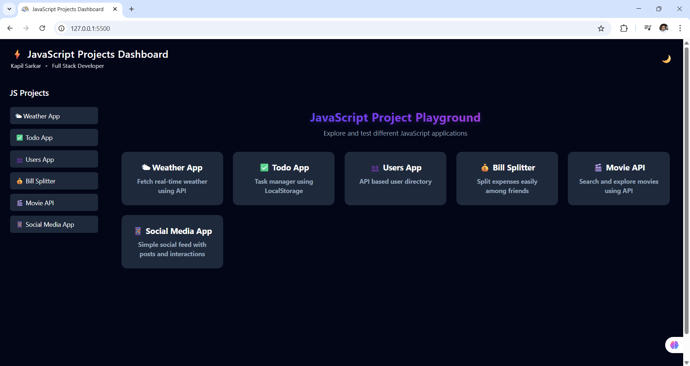
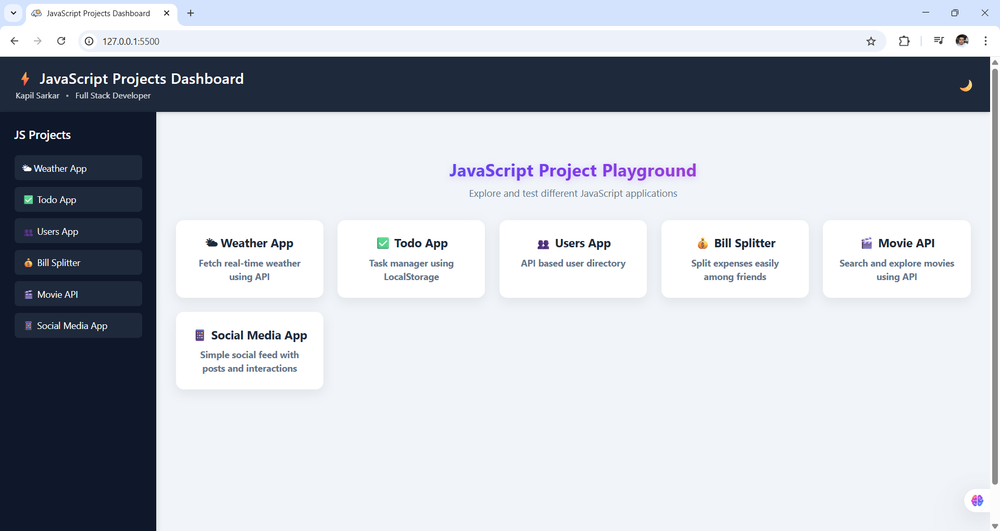
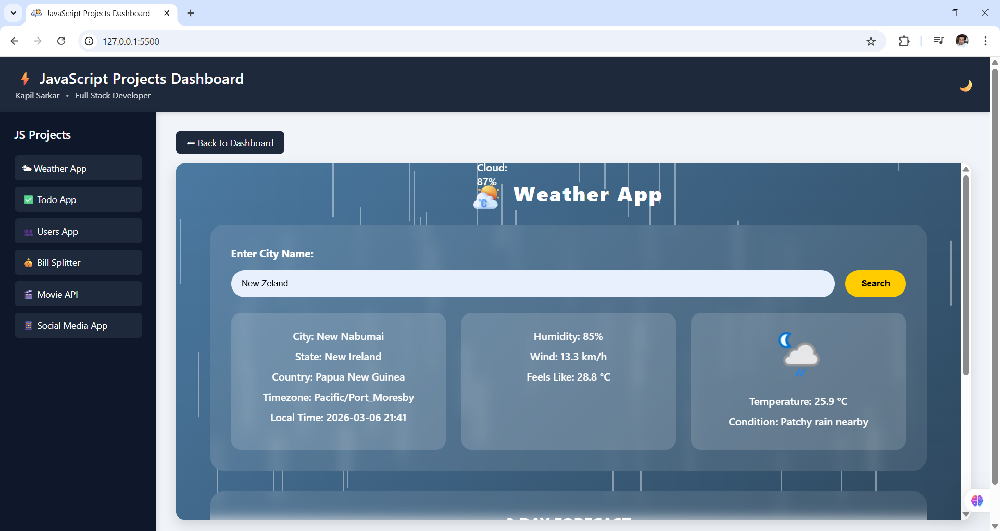
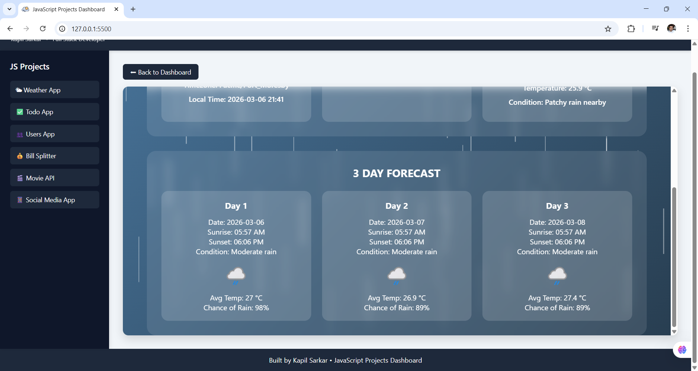
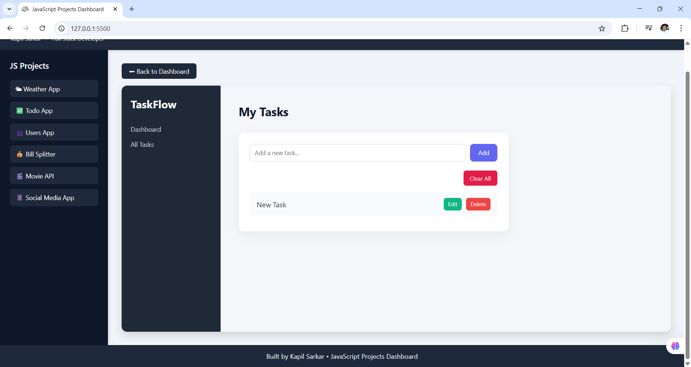
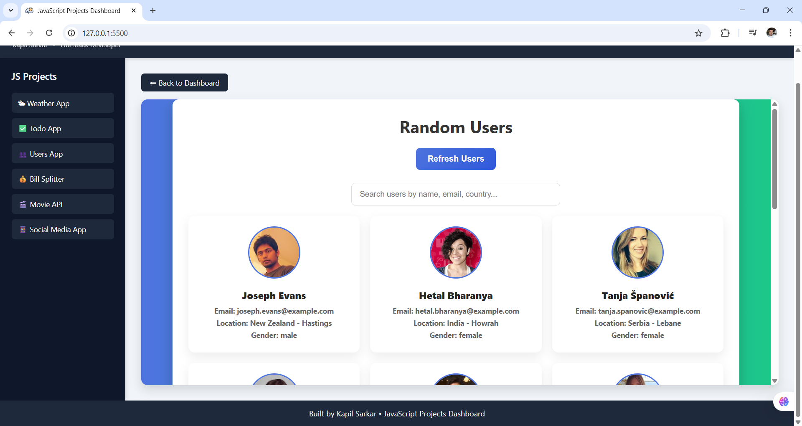
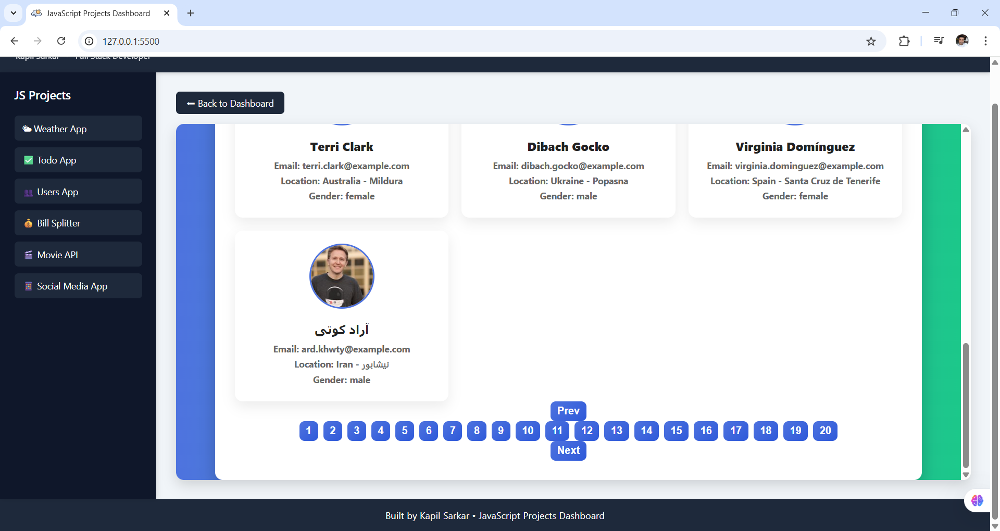
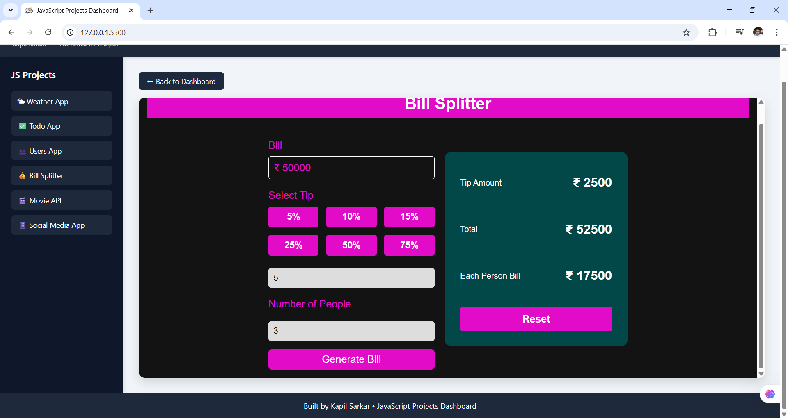
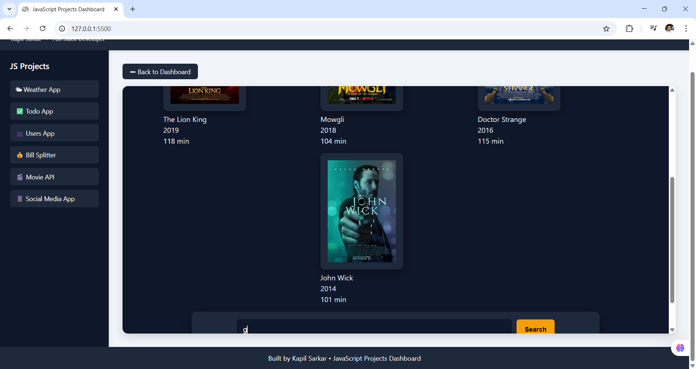
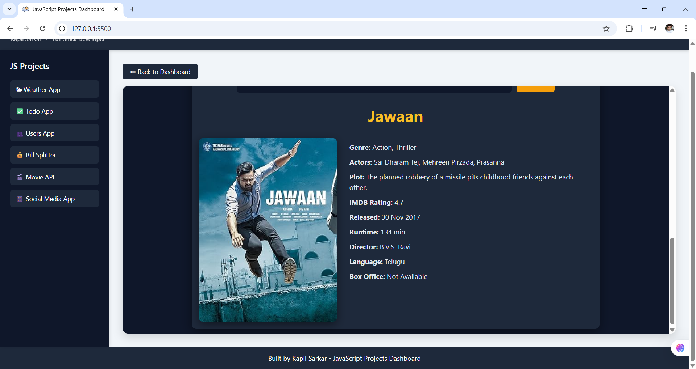

# ⚡ JavaScript Projects Dashboard


A collection of **interactive Vanilla JavaScript mini-projects** combined into a single **dashboard interface**.

Instead of deploying each project separately, all apps are accessible through a **central dashboard with sidebar navigation**.

This project demonstrates **DOM manipulation, API integration, responsive UI design, and modular project architecture**.

---

# 🚀 Live Demo

👉https://jsdashboard-two.vercel.app/

---

# 📌 Features

## 🧭 Dashboard Navigation

* Sidebar navigation
* Project cards launcher
* Embedded project viewer using **iframe**
* Back to dashboard button
* Responsive mobile layout

## 🎨 UI Features

* Dark theme UI
* Hover animations
* Animated project cards
* Responsive layout

---

# 🧩 Included Projects

## 🌤 Weather App

Fetch real-time weather information using a weather API.

**Features**

* Search city weather
* Temperature and weather details
* API integration

---

## ✅ Todo App

A simple **task manager** using LocalStorage.

**Features**

* Add tasks
* Delete tasks
* Persistent storage using LocalStorage

---

## 👥 Users App

Fetch and display user data from an API.

**Features**

* API data fetching
* Dynamic user cards
* Responsive layout

---

## 💰 Bill Splitter

Calculate and split expenses between friends.

**Features**

* Expense calculation
* Simple UI interaction

---

## 🎬 Movie Search App

Search movies using the **OMDb API**.

Displays:

* Movie poster
* Genre
* Actors
* Plot
* IMDB rating
* Release date

---

## 📱 Social Media Mini App

Interactive UI inspired by social media platforms.

**Features**

* Follow / Following button
* Like and dislike counters
* Comment system
* Profile switching

---

# 🗂 Project Structure

```
javascript-projects-dashboard/
│
├── index.html
├── style.css
├── app.js
│
└── projects/
     ├── weather/
     ├── todo/
     ├── users/
     ├── bill-splitter/
     ├── movie-api/
     └── social-media/
```

Each project runs independently but is loaded inside the dashboard using an **iframe**.

---

# 🛠 Technologies Used

* **HTML5**
* **CSS3**
* **Vanilla JavaScript**
* **Fetch API**
* **LocalStorage**
* **Responsive Design**

---

# 🧠 Skills Demonstrated

This project demonstrates several important **frontend development skills**:

* DOM Manipulation
* API Integration
* LocalStorage usage
* Modular project architecture
* Responsive UI development
* Multi-project dashboard design

---

# ⚙️ Installation

Clone the repository

```
git clone https://github.com/yourusername/javascript-projects-dashboard.git
```

Open the project folder and run **index.html** in your browser.

---

# 📷 Screenshots

## Dashboard




## Weather App




## Todo App



## Users App




## Bill Splitter



## Movie Search App




---

# 🎯 Purpose of This Project

This project was created to:

* Practice **JavaScript fundamentals**
* Build multiple **interactive frontend applications**
* Learn **API integration**
* Improve **DOM manipulation skills**
* Organize mini projects into a **single developer dashboard**

---

# 🚧 Future Improvements

Planned enhancements:

* Active sidebar project indicator
* Loading animations
* More JavaScript mini apps
* Improved UI transitions
* Project search inside dashboard

---

# 👨‍💻 Author

**Kapil Sarkar**

Frontend / Full Stack Developer

---


## Upcoming Projects

- E-Commerce UI

- Expense Tracker

- Quiz App

- Notes App

- Password Generator

- Kanban Task Board (Trello Clone)

# ⭐ Support

If you like this project, consider giving it a **⭐ star on GitHub**.

It helps the project grow and motivates further improvements.
