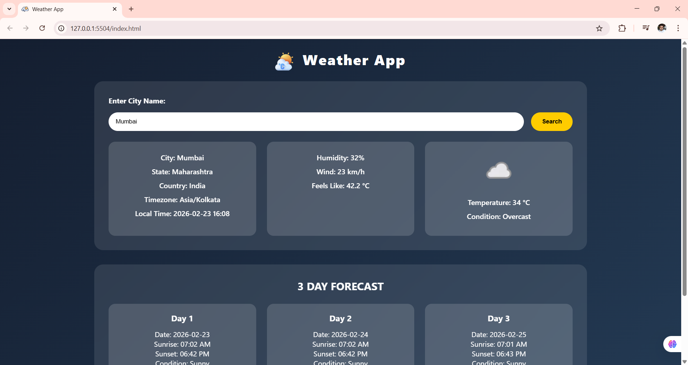

### 🌤 Weather App

A modern and responsive Weather Application built using HTML, CSS, and Vanilla JavaScript.

This app fetches real-time weather data and a 3-day forecast using the WeatherAPI and displays dynamic animated backgrounds based on weather conditions.




 🚀 Features

- 🌍 Search weather by city name

- 📍 Default weather shows Asansol, West Bengal

- 📅 3-Day Weather Forecast

- 🌦 Dynamic animated backgrounds (Sunny, Rainy, Cloudy, Thunder, Night)

- 💧 Rain animation effect

- ⏳ Loading & error handling

- 📱 Fully responsive design

🛠 Tech Stack

- HTML5

- CSS3

- Vanilla JavaScript (ES6+)

- WeatherAPI


🔌 API Used

- 🌐 WeatherAPI

```js
https://api.weatherapi.com/v1/forecast.json
```

📷 How It Works

1. On page load → Shows weather for Asansol.

1. User enters city name in search box.

2. App fetches:

3. Current weather

4. 3-day forecast

5. Background changes automatically based on weather condition.