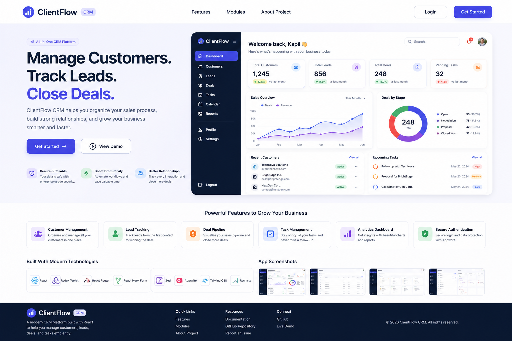

# React CRM Platform

## Project Goal

Build a modern CRM (Customer Relationship Management) application using
React to demonstrate production-ready frontend development skills.

**Focus:** Learn React deeply. Keep the project clean, maintainable, and
scalable.



------------------------------------------------------------------------

## Tech Stack

- React (Vite)
- Tailwind CSS
- React Router
- React Hook Form
- Zod
- Redux Toolkit
- Appwrite
- React Toastify
- Recharts (Dashboard Charts)

------------------------------------------------------------------------

## Learning Goals

This project is designed to practice:

- React Components
- React Router
- React Hook Form
- Zod Validation
- Redux Toolkit
- useRef
- Custom Hooks
- useMemo
- useCallback
- Lazy Loading
- Appwrite Authentication
- Appwrite Database
- Appwrite Storage

------------------------------------------------------------------------

## Folder Structure

``` text
src/
│
├── assets/
├── components/
│   ├── common/
│   ├── forms/
│   ├── layout/
│   ├── dashboard/
│   └── ui/
│
├── pages/
│   ├── auth/
│   ├── dashboard/
│   ├── customers/
│   ├── leads/
│   ├── deals/
│   ├── tasks/
│   ├── profile/
│   └── settings/
│
├── hooks/
├── redux/
├── routes/
├── services/
├── utils/
├── constants/
├── layouts/
└── App.jsx
```

------------------------------------------------------------------------

## Modules

## 1. Authentication

Features

- Register
- Login
- Logout
- Protected Routes

Learn

- React Hook Form
- Zod
- Appwrite Auth
- React Router

------------------------------------------------------------------------

## 2. Dashboard

Widgets

- Total Customers
- Total Leads
- Total Deals
- Pending Tasks

Sections

- Recent Customers
- Recent Leads
- Upcoming Tasks

Learn

- Redux Toolkit
- Recharts
- Reusable Cards

------------------------------------------------------------------------

## 3. Customer Management

CRUD Operations

Fields

- Full Name
- Email
- Phone
- Company
- Status

Extra Features

- Search
- Pagination

------------------------------------------------------------------------

## 4. Lead Management

CRUD Operations

Lead Status

- New
- Contacted
- Qualified
- Won
- Lost

Fields

- Name
- Company
- Phone
- Email
- Status

------------------------------------------------------------------------

## 5. Deal Management

CRUD Operations

Fields

- Deal Name
- Customer
- Amount
- Stage

Stages

- Open
- Negotiation
- Closed

------------------------------------------------------------------------

## 6. Task Management

CRUD Operations

Fields

- Title
- Description
- Due Date
- Priority

Priority

- High
- Medium
- Low

Mark task as completed.

------------------------------------------------------------------------

## 7. Profile

- Update Name
- Update Email
- Upload Profile Picture

------------------------------------------------------------------------

## 8. Settings

- Dark Mode
- Light Mode

------------------------------------------------------------------------

## Redux Store

Suggested Slices

- authSlice
- customerSlice
- leadSlice
- dealSlice
- taskSlice
- themeSlice

------------------------------------------------------------------------

## Custom Hooks

- useAuth()
- usePagination()
- useSearch()
- useDebounce()
- useTheme()

------------------------------------------------------------------------

## Reusable Components

- Button
- Input
- Card
- Table
- Modal
- Loader
- Pagination
- Search Bar
- Sidebar
- Navbar
- ProtectedRoute

------------------------------------------------------------------------

## Routing

Public

- Login
- Register

Protected

- Dashboard
- Customers
- Leads
- Deals
- Tasks
- Profile
- Settings

Include:

- Nested Routes
- Lazy Loading
- 404 Page

------------------------------------------------------------------------

## Development Roadmap

## Phase 1

Project Setup

## Phase 2

Authentication

## Phase 3

Dashboard

## Phase 4

Customer Management

## Phase 5

Lead Management

## Phase 6

Deal Management

## Phase 7

Task Management

## Phase 8

Profile & Settings

## Phase 9

Performance Optimization

## Phase 10

Deployment

------------------------------------------------------------------------

## What This Project Intentionally Excludes

These features will be added after learning Node.js and building a MERN
backend.

- AI Features
- Email Automation
- Notifications
- Team Collaboration
- Audit Logs
- Payment Integration
- Backend APIs
- Real-time Updates
- Advanced Roles & Permissions

------------------------------------------------------------------------

## Final Outcome

By completing this project you will have:

- A professional React portfolio project
- Strong understanding of advanced React concepts
- Experience building a scalable application
- Confidence to start learning Next.js

------------------------------------------------------------------------
