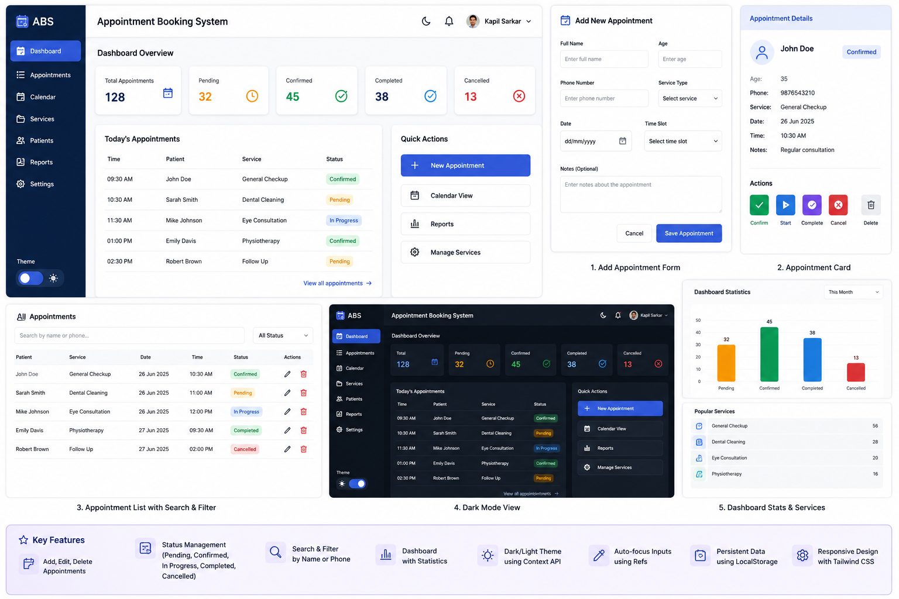
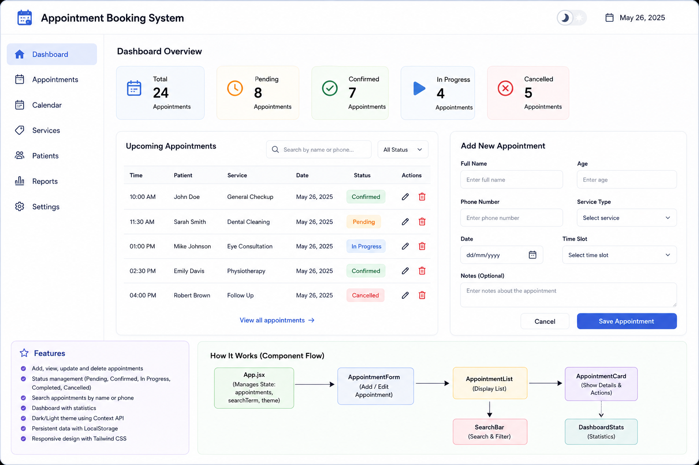

# Appointment Booking System

A modern React-based Appointment Booking System built to practice real-world frontend development concepts.

This project simulates a complete appointment management workflow similar to:

* Doctor appointments
* Salon bookings
* Consultation scheduling
* Coaching sessions

---

## Project Goal

Build a modern CRUD-based booking system using React.

This project will strengthen:

* Component architecture
* State management
* Props handling
* Refs
* Context API
* Real-world UI patterns

---

## Features to Build

## 1. Add Appointment

Users can create new appointments.

Fields:

* Full Name
* Age
* Phone Number
* Service Type
* Date
* Time Slot
* Notes

Concepts:

* Controlled inputs
* Form state
* Validation

---

## 2. View Appointments

Display all appointments as cards or rows.

Each appointment should show:

* Name
* Service
* Date
* Time
* Status

Concepts:

* `map()`
* props
* reusable cards

---

## 3. Update Appointment Status

Each appointment should support status updates.

Statuses:

* Pending
* Confirmed
* In Progress
* Completed
* Cancelled

Concepts:

* State updates
* Conditional rendering
* Dynamic classes

---

## 4. Delete Appointment

Allow deleting appointments.

Concepts:

* `filter()`
* state updates

---

## 5. Search Appointment

Search by:

* Name
* Phone number

Concepts:

* Derived state
* Filtering arrays

---

## 6. Dashboard Statistics

Show:

* Total appointments
* Pending
* Completed
* Cancelled

Concepts:

* `reduce()`
* Derived data

---

## 7. Theme Toggle (Context API)

Use:

* Light mode
* Dark mode

Concepts:

* Context API
* Custom hooks
* Shared global state

---

## 8. Auto Focus (Refs)

After adding appointment:

Focus first input automatically.

Concepts:

* `useRef`
* `forwardRef`

---

## 9. LocalStorage Persistence

Save all appointments.

Concepts:

* `useEffect`
* LocalStorage

Data remains after refresh.

---

## Project Structure

```text id="7pmv0h"
src/
│── components/
│   │── AppointmentForm.jsx
│   │── AppointmentList.jsx
│   │── AppointmentCard.jsx
│   │── DashboardStats.jsx
│   │── SearchBar.jsx
│   │── ThemeToggle.jsx
│   │── EmptyState.jsx
│
│── context/
│   │── ThemeContext.jsx
│
│── hooks/
│   │── useLocalStorage.js
│
│── utils/
│   │── statusColors.js
│
│── App.jsx
│── main.jsx
```

---

## Data Structure

Each appointment:

```js id="avt8y5"
{
  id: Date.now(),
  name: "Kapil Sarkar",
  age: 35,
  phone: "9876543210",
  service: "General Checkup",
  date: "2026-06-27",
  time: "10:30 AM",
  notes: "Regular consultation",
  status: "pending"
}
```

---

## Step-by-Step Build Guide

---

## Step 1: Setup Project

Create Vite project:

```bash id="mt7lfo"
npm create vite@latest
```

Install dependencies:

```bash id="b9rtt1"
npm install
```

Install Tailwind:

```bash id="z9y3g6"
npm install tailwindcss @tailwindcss/vite
```

---

## Step 2: Create Folder Structure

Create:

* components
* context
* hooks
* utils

Keep code organized.

---

## Step 3: Build Appointment Form

Create:

```text id="77v20e"
AppointmentForm.jsx
```

Responsibilities:

* Form inputs
* Validation
* Submit data

Use:

* `useState`
* refs

---

## Step 4: Manage Main State

In:

```text id="ctpx3w"
App.jsx
```

Store:

```js id="hz83pl"
appointments
searchTerm
theme
```

This is the parent controller.

---

## Step 5: Create Appointment List

Build:

```text id="g9kg7z"
AppointmentList.jsx
```

Responsibilities:

* Loop through appointments
* Render cards

Use:

```js id="4dlz5m"
appointments.map()
```

---

## Step 6: Create Appointment Card

Build:

```text id="n5o0qv"
AppointmentCard.jsx
```

Responsibilities:

* Show appointment details
* Status buttons
* Delete button

Use:

* complex props
* children props

---

## Step 7: Create Dashboard Stats

Build:

```text id="4fag7u"
DashboardStats.jsx
```

Responsibilities:

Calculate:

* total
* pending
* completed

Use:

```js id="x4mowx"
reduce()
```

---

## Step 8: Add Search

Build:

```text id="z3xpt5"
SearchBar.jsx
```

Responsibilities:

* Search by name
* Search by phone

Use:

```js id="6q5s8h"
filter()
```

---

## Step 9: Add Theme Context

Build:

```text id="6m2qj2"
ThemeContext.jsx
```

Responsibilities:

* Global theme
* Toggle theme

Use:

* createContext
* useContext

---

## Step 10: Add LocalStorage

Create:

```text id="j5w77x"
useLocalStorage.js
```

Responsibilities:

* Save appointments
* Load appointments

Use:

* useEffect

---

## Component Flow

```text id="mwybph"
App
│
├── AppointmentForm
│
├── SearchBar
│
├── DashboardStats
│
└── AppointmentList
     │
     └── AppointmentCard
```

---

## Topics Covered

## React Core

✔ useState
✔ useEffect
✔ useRef
✔ useContext

---

## Props

✔ Basic Props
✔ Children Props
✔ Complex Props
✔ Ref Props

---

## Logic

✔ CRUD
✔ Search
✔ Filter
✔ Status Update
✔ LocalStorage
✔ Derived State

---

## UI

✔ Tailwind CSS
✔ Theme Toggle
✔ Responsive Design
✔ Cards
✔ Dashboard Layout

---

## Future Improvements

You can add:

* Calendar view
* Time slot filtering
* Export appointments
* Email reminder
* Notifications
* Drag and drop
* Framer Motion animations
* Backend integration
* Authentication

---

## Why This Project?

This project is stronger than:

* Todo App
* Counter App
* Weather App

Because it simulates:

```text id="bsk0ql"
Real business software
```

Good for:

* Portfolio
* Freelancing
* Job interviews
* MERN preparation

---

## Final Goal

After completing this project you should be comfortable with:

✔ Real-world component structure
✔ Advanced props usage
✔ CRUD applications
✔ Context API
✔ Refs
✔ LocalStorage
✔ Scalable frontend architecture

This project is a bridge between beginner React and professional frontend development.




