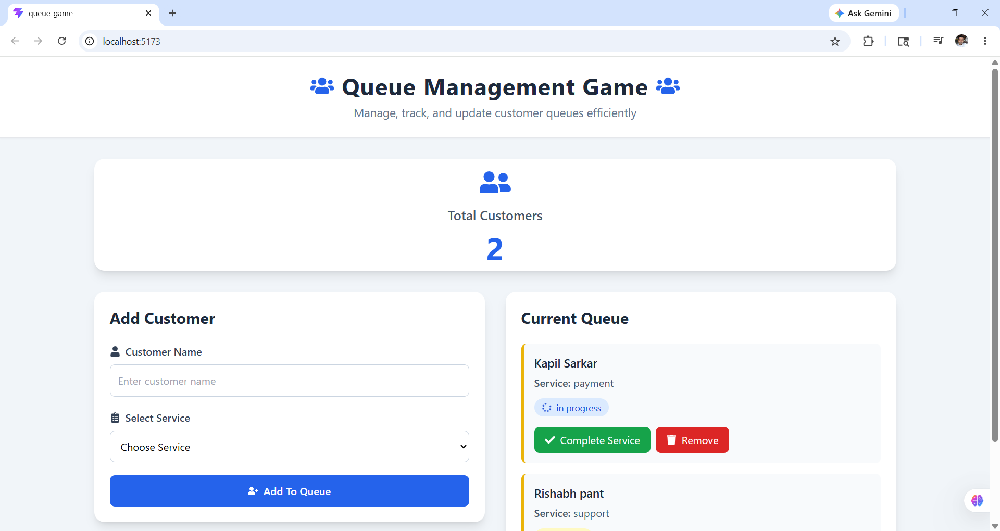
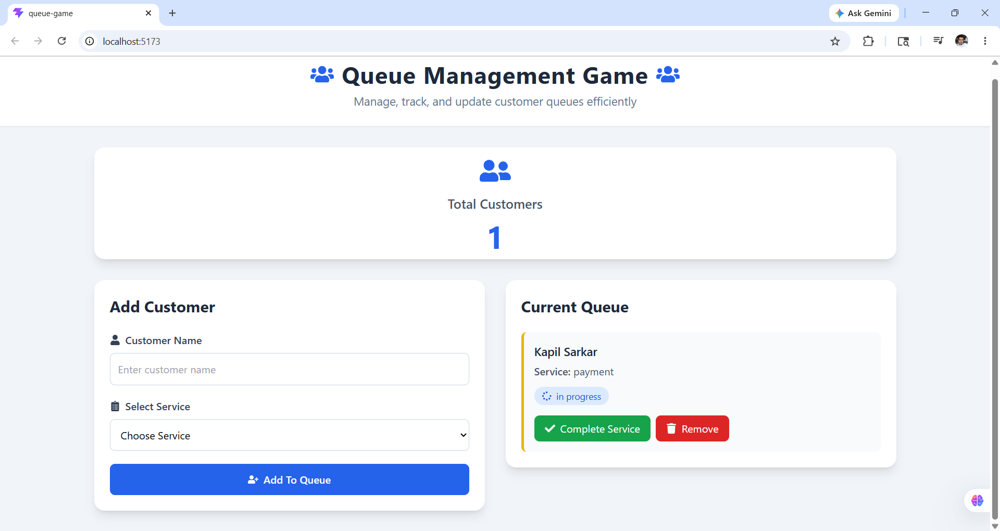

# Queue Management App — React Data Flow

[LIVE LINK](https://queue-game.vercel.app/)

### PREVIEW :



# Features

- Add Customers to Queue
- Update Customer Status
- Remove Customers
- Dynamic Queue Counter
- Conditional Rendering
- Responsive Tailwind UI
- React Icons Integration
- Derived State Management

A beginner-friendly React Queue Management Application built with:

- React.js
- useState Hook
- Tailwind CSS
- React Icons
- Component-Based Architecture

This project demonstrates:

- CRUD Operations
- React State Management
- Conditional Rendering
- Derived State
- Functional State Updates
- Parent ↔ Child Communication
- React Rendering Flow

---

# Table of Contents

| Section | Description |
|---|---|
| [1. Project Overview](#1-project-overview) | Introduction to the project |
| [2. Folder Structure](#2-folder-structure) | Project file organization |
| [3. Full Application Architecture](#3-full-application-architecture) | Component hierarchy |
| [4. How Data Flows in React](#4-how-data-flows-in-react) | React data flow visualization |
| [5. Step-by-Step React Flow](#5-step-by-step-react-flow) | Full application execution flow |
| [6. Understanding addToQueue()](#6-understanding-addtoqueue) | Create operation logic |
| [7. Breaking Down the Logic](#7-breaking-down-the-logic) | Deep explanation of add logic |
| [8. Why Functional Updates?](#8-why-functional-updates) | Functional state updates |
| [9. Important React Concepts](#9-important-react-concepts) | Immutable update explanation |
| [10. React Render Cycle](#10-react-render-cycle) | React re-render process |
| [11. React Terminology](#11-react-terminology) | Important React terms |
| [12. Core React Concepts Used](#12-core-react-concepts-used) | Main React concepts summary |
| [13. Final React Architecture](#13-final-react-architecture) | Final architecture diagram |
| [14. Future Improvements](#14-future-improvements) | Future feature ideas |
| [15. Understanding removeFromQueue()](#15-understanding-removefromqueue) | Delete operation logic |
| [16. Understanding updateQueueStatus()](#16-understanding-updatequeuestatus) | Update operation logic |
| [17. Understanding Derived State](#17-understanding-derived-state) | Derived state explanation |

---

# Quick CRUD Revision Table

| CRUD Operation | React Method Used |
|---|---|
| Create | Spread Operator (`...`) |
| Read | `map()` |
| Update | `map()` |
| Delete | `filter()` |

---

# React Data Flow Summary

| Direction | Explanation |
|---|---|
| Parent → Child | Data passed through props |
| Child → Parent | Callback functions passed as props |
| State Location | `App.jsx` |
| Shared State Pattern | Lifting State Up |

---

# React State Principles Used

| Principle | Purpose |
|---|---|
| Immutable Updates | Prevent direct state mutation |
| Functional Updates | Safely update latest state |
| Derived State | Calculate values from existing state |
| Conditional Rendering | Dynamically render UI |
| Re-rendering | UI updates automatically after state changes |

---

# 1. Project Overview

This project is a beginner-friendly Queue Management Application built using:

- React.js
- useState Hook
- Tailwind CSS
- Component-Based Architecture

The application allows users to:

- Add customers to a queue
- Display customer queue data
- Manage queue state dynamically

Future improvements:

- Remove customer
- Update customer status
- Delete functionality
- Backend integration
- Local storage persistence

---

# 2. Folder Structure

```text
src/
│
├── components/
│   ├── QueueForm.jsx
│   └── QueueDisplay.jsx
│
├── App.jsx
├── main.jsx
└── index.css
```

---

# 3. Full Application Architecture

```text
                    ┌─────────────────────┐
                    │      App.jsx        │
                    │─────────────────────│
                    │ queue state lives   │
                    │ useState([])        │
                    └─────────┬───────────┘
                              │
              ┌───────────────┴───────────────┐
              │                               │
              │ props                         │ props
              ▼                               ▼

    ┌────────────────────┐      ┌────────────────────────┐
    │   QueueForm.jsx    │      │   QueueDisplay.jsx     │
    │────────────────────│      │────────────────────────│
    │ Takes user input   │      │ Displays queue data    │
    │ Sends data upward  │      │ Receives queue props   │
    └────────────────────┘      └────────────────────────┘
```

---

# 4. How Data Flows in React

```text
 USER TYPES DATA
        │
        ▼

┌────────────────────┐
│   QueueForm.jsx    │
│────────────────────│
│ name state         │
│ service state      │
└─────────┬──────────┘
          │
          │ onAdd({ name, service })
          ▼

┌────────────────────┐
│      App.jsx       │
│────────────────────│
│ addToQueue()       │
│ setQueue()         │
└─────────┬──────────┘
          │
          │ Updated queue state
          ▼

┌────────────────────┐
│ QueueDisplay.jsx   │
│────────────────────│
│ queue.map()        │
│ displays customers │
└────────────────────┘
```

---

# 5. Step-by-Step React Flow

---

## STEP 1 — User Enters Data

User types:

```js
Name = "Kapil"
Service = "Consultation"
```

inside:

```js
QueueForm.jsx
```

---

## STEP 2 — Form Submission

When the Submit button is clicked:

```js
onAdd({ name, service })
```

runs.

---

## STEP 3 — Child Sends Data Upward

`QueueForm.jsx` calls:

```js
onAdd({ name, service })
```

The `onAdd` prop actually references:

```js
addToQueue()
```

inside:

```js
App.jsx
```

---

## STEP 4 — Parent Updates State

Inside `App.jsx`:

```js
addToQueue(customer)
```

runs.

React updates queue state using:

```js
setQueue((prevQueue) => [
  ...prevQueue,
  newCustomer
])
```

---

## STEP 5 — React Re-renders

After state changes:

```text
React automatically re-renders components
```

Updated queue state is passed to:

```js
QueueDisplay.jsx
```

through props.

---

## STEP 6 — QueueDisplay Renders Data

```js
queue.map()
```

loops through all queue items and displays them on screen.

---

# 6. Understanding addToQueue()

---

## Function

```js
const addToQueue = (customer) => {
  setQueue((prevQueue) => [
    ...prevQueue,
    {
      ...customer,
      id: Date.now(),
      status: "waiting",
    },
  ]);
};
```

---

# Purpose

This function:

- keeps old queue data
- adds new customer
- creates unique id
- assigns default status
- updates React state

---

# addToQueue() Visual Flow

```text
Customer Data Comes From QueueForm
                │
                ▼

     onAdd({ name, service })
                │
                ▼

      addToQueue(customer)
                │
                ▼

 setQueue((prevQueue) => [...])
                │
                ▼

 React Creates New Queue Array
                │
                ▼

 QueueDisplay.jsx Re-renders
```

---

# 7. Breaking Down the Logic

---

## STEP 1 — Function Receives Customer

```js
customer
```

Example:

```js
{
  name: "Kapil",
  service: "consultation"
}
```

---

## STEP 2 — Previous Queue State

```js
prevQueue
```

represents old queue data.

Example:

```js
[
  {
    id: 1,
    name: "Rahul",
    service: "payment",
    status: "waiting"
  }
]
```

---

## STEP 3 — Spread Previous Queue

```js
...prevQueue
```

copies all previous customers.

---

## STEP 4 — Create New Customer Object

```js
{
  ...customer,
  id: Date.now(),
  status: "waiting"
}
```

creates a new customer object.

---

# Object Breakdown

```js
...customer
```

copies:

```js
{
  name: "Kapil",
  service: "consultation"
}
```

Then adds:

```js
id: Date.now()
status: "waiting"
```

Final object:

```js
{
  name: "Kapil",
  service: "consultation",
  id: 171234567,
  status: "waiting"
}
```

---

## STEP 5 — New Queue Array Created

```js
[
  ...prevQueue,
  newCustomer
]
```

Example:

BEFORE:

```js
[
  {
    name: "Rahul"
  }
]
```

AFTER:

```js
[
  {
    name: "Rahul"
  },

  {
    name: "Kapil"
  }
]
```

---

# 8. Why Functional Updates?

```js
setQueue((prevQueue) => [...])
```

is safer than:

```js
setQueue([...queue])
```

because React state updates are asynchronous.

Functional updates always use the latest state.

---

# 9. Important React Concepts

---

## Immutable Updates

React state should NEVER be modified directly.

❌ Wrong:

```js
queue.push(newCustomer)
```

✅ Correct:

```js
[
  ...prevQueue,
  newCustomer
]
```

React prefers creating NEW arrays instead of modifying old arrays.

---

# Visual State Update Flow

```text
OLD QUEUE
──────────────

[
  Rahul
]

        +
        │
        ▼

NEW CUSTOMER
──────────────

{
  Kapil
}

        │
        ▼

NEW QUEUE
──────────────

[
  Rahul,
  Kapil
]
```

---

# 10. React Render Cycle

```text
User Action
    │
    ▼

setQueue()
    │
    ▼

State Changes
    │
    ▼

React Detects Update
    │
    ▼

App.jsx Re-renders
    │
    ▼

Updated Props Sent
    │
    ▼

QueueDisplay.jsx Updates UI
```

---

# 11. React Terminology

| Concept | Meaning |
|---|---|
| State | Dynamic data managed by React |
| Props | Data passed between components |
| Controlled Component | Form controlled by React state |
| Re-render | React updating UI after state change |
| Callback Function | Function passed as prop |
| Immutable Update | Creating new arrays/objects instead of modifying old ones |

---

# 12. Core React Concepts Used

✅ useState()

✅ Controlled Components

✅ Props

✅ Callback Props

✅ Conditional Rendering

✅ List Rendering using map()

✅ Immutable State Updates

✅ Parent → Child Data Flow

✅ Child → Parent Communication

✅ Lifting State Up

✅ Functional State Updates

✅ Array Spread Operator

✅ Object Spread Operator

---

# 13. Final React Architecture

```text
                    App.jsx
                       │
         ┌─────────────┴─────────────┐
         │                           │
         ▼                           ▼

   QueueForm.jsx             QueueDisplay.jsx
         │                           ▲
         │                           │
         └────── Sends Data ─────────┘
```

---

# 14. Future Improvements

- Add remove customer functionality
- Add update status feature
- Add completed queue section

---

# 15. Understanding removeFromQueue()

---

## Function

```js
const removeFromQueue = (id) => {
  setQueue((prevQueue) =>
    prevQueue.filter((customer) => customer.id !== id)
  );
};
```

---

# Purpose

This function removes a customer from the queue using their unique `id`.

It:

- checks all customers
- removes matching customer
- creates a new array
- updates React state
- re-renders UI automatically

---

# How removeFromQueue() Works

```text
User Clicks Remove Button
                │
                ▼

 QueueDisplay.jsx
                │
                │ onRemove(customer.id)
                ▼

     removeFromQueue(id)
                │
                ▼

 filter() removes customer
                │
                ▼

 React Creates New Array
                │
                ▼

 setQueue() updates state
                │
                ▼

 QueueDisplay.jsx Re-renders
```

---

# Passing remove Function as Props

Inside `App.jsx`:

```js
<QueueDisplay
  queue={queue}
  onRemove={removeFromQueue}
/>
```

Here:

```js
onRemove
```

references:

```js
removeFromQueue
```

and sends the function to:

```js
QueueDisplay.jsx
```

---

# Child Component Receives Function

Inside:

```js
QueueDisplay.jsx
```

the child component receives:

```js
const QueueDisplay = ({ queue, onRemove }) => {
```

Now `QueueDisplay` can call:

```js
onRemove(customer.id)
```

which actually runs:

```js
removeFromQueue(customer.id)
```

inside:

```js
App.jsx
```

---

# Remove Button Logic

```js
<button onClick={() => onRemove(customer.id)}>
  Remove
</button>
```

When clicked:

- customer id is sent upward
- parent function executes
- queue updates
- UI refreshes automatically

---

# Understanding filter()

```js
prevQueue.filter((customer) => customer.id !== id)
```

`filter()`:

- keeps matching items
- removes non-matching items
- returns a NEW array

---

# Example

Suppose queue is:

```js
[
  { id: 1, name: "Kapil" },
  { id: 2, name: "Rahul" },
  { id: 3, name: "Amit" }
]
```

Now:

```js
removeFromQueue(2)
```

runs.

---

# filter() Checks Each Customer

---

## Customer 1

```js
1 !== 2
```

✅ true → keep

---

## Customer 2

```js
2 !== 2
```

❌ false → remove

---

## Customer 3

```js
3 !== 2
```

✅ true → keep

---

# Final Updated Queue

```js
[
  { id: 1, name: "Kapil" },
  { id: 3, name: "Amit" }
]
```

Rahul is removed successfully.

---

# Visual Queue Update

```text
OLD QUEUE
────────────────

[
  Kapil,
  Rahul,
  Amit
]

        │
        │ Remove Rahul
        ▼

NEW QUEUE
────────────────

[
  Kapil,
  Amit
]
```

---

# Why filter() is Good for React

```js
filter()
```

does NOT modify original array.

Instead:

- creates new array
- keeps React state immutable
- triggers proper re-rendering

---

# Important React Concepts Used

✅ filter()

✅ Immutable Updates

✅ Functional State Updates

✅ Callback Props

✅ Child → Parent Communication

✅ React Re-rendering

✅ Dynamic List Updates

---

# 16. Understanding updateQueueStatus()

---

## Function

```js
const updateQueueStatus = (id, newStatus) => {
  setQueue((prevQueue) =>
    prevQueue.map((customer) =>
      customer.id === id
        ? { ...customer, status: newStatus }
        : customer
    )
  );
};
```

---

# Purpose

This function updates the status of a specific customer inside the queue.

It:

- checks every customer
- finds matching customer using id
- updates only that customer
- keeps all other customers unchanged
- creates a new queue array
- updates React state
- re-renders UI automatically

---

# How updateQueueStatus() Works

```text
User Clicks Status Button
                │
                ▼

 QueueDisplay.jsx
                │
                │ onUpdateStatus(id, newStatus)
                ▼

 updateQueueStatus(id, newStatus)
                │
                ▼

 map() checks every customer
                │
                ▼

 Matching customer updated
                │
                ▼

 React Creates New Queue Array
                │
                ▼

 setQueue() updates state
                │
                ▼

 QueueDisplay.jsx Re-renders
```

---

# Passing Update Function as Props

Inside:

```js
App.jsx
```

```js
<QueueDisplay
  queue={queue}
  onRemove={removeFromQueue}
  onUpdateStatus={updateQueueStatus}
/>
```

Here:

```js
onUpdateStatus
```

references:

```js
updateQueueStatus
```

and passes the function to:

```js
QueueDisplay.jsx
```

---

# Child Component Receives Function

Inside:

```js
QueueDisplay.jsx
```

```js
const QueueDisplay = ({
  queue,
  onRemove,
  onUpdateStatus,
}) => {
```

Now child component can call:

```js
onUpdateStatus(customer.id, "completed")
```

which actually runs:

```js
updateQueueStatus(customer.id, "completed")
```

inside:

```js
App.jsx
```

---

# Update Button Logic

```js
<button
  onClick={() =>
    onUpdateStatus(customer.id, "in-progress")
  }
>
  Start Service
</button>
```

When clicked:

- customer id is sent upward
- new status is sent upward
- parent function executes
- queue updates
- UI refreshes automatically

---

# Understanding map()

```js
prevQueue.map((customer) => ...)
```

`map()`:

- loops through every customer
- checks each customer
- returns a NEW array

React commonly uses:

- `map()` for updates
- `filter()` for deletions

---

# Understanding the Ternary Operator

```js
customer.id === id
  ? { ...customer, status: newStatus }
  : customer
```

This is shorthand for:

```js
if (customer.id === id) {
  return updatedCustomer;
} else {
  return originalCustomer;
}
```

---

# Step-by-Step Update Logic

---

## STEP 1 — map() Loops Through Queue

Suppose queue:

```js
[
  {
    id: 1,
    name: "Kapil",
    status: "waiting"
  },

  {
    id: 2,
    name: "Rahul",
    status: "waiting"
  }
]
```

Now:

```js
updateQueueStatus(1, "in-progress")
```

runs.

---

## STEP 2 — React Checks Every Customer

---

### Customer 1

```js
customer.id === id
```

becomes:

```js
1 === 1
```

✅ true

So React creates updated object:

```js
{
  ...customer,
  status: "in-progress"
}
```

Updated customer:

```js
{
  id: 1,
  name: "Kapil",
  status: "in-progress"
}
```

---

### Customer 2

```js
2 === 1
```

❌ false

So React keeps customer unchanged:

```js
customer
```

---

# Final Updated Queue

```js
[
  {
    id: 1,
    name: "Kapil",
    status: "in-progress"
  },

  {
    id: 2,
    name: "Rahul",
    status: "waiting"
  }
]
```

Only Kapil gets updated.

---

# Visual Update Flow

```text
OLD QUEUE
────────────────

[
  Kapil → waiting
  Rahul → waiting
]

        │
        │ updateQueueStatus(1, "in-progress")
        ▼

map() checks every customer
        │
        ▼

NEW QUEUE
────────────────

[
  Kapil → in-progress
  Rahul → waiting
]
```

---

# Why React Uses map() for Updates

```js
map()
```

does NOT modify original array.

Instead:

- creates new array
- keeps React state immutable
- helps React detect changes properly

---

# Understanding Conditional Rendering

Inside:

```js
QueueDisplay.jsx
```

buttons are shown conditionally.

---

## Example

```js
{
  customer.status === "waiting" && (
    <button>
      Start Service
    </button>
  )
}
```

This means:

```text
IF customer status is "waiting"
THEN show button
ELSE show nothing
```

---

# Conditional Rendering Flow

```text
customer.status
        │
        ▼

Is status "waiting" ?
        │
 ┌──────┴──────┐
 │             │
YES           NO
 │             │
 ▼             ▼

Show          Show
Button        Nothing
```

---

# Status-Based UI Logic

---

## waiting

```text
✔ Start Service Button
❌ Complete Service Button
```

---

## in-progress

```text
❌ Start Service Button
✔ Complete Service Button
```

---

## completed

```text
❌ Start Service Button
❌ Complete Service Button
```

Only Remove button remains visible.

---

# Why Conditional Rendering is Important

React creates dynamic UI based on state.

This means:

```text
Different state
=
Different UI
```

The interface automatically changes when data changes.

---

# Important React Concepts Used

✅ map()

✅ Ternary Operator

✅ Conditional Rendering

✅ Functional State Updates

✅ Immutable Updates

✅ Dynamic UI Rendering

✅ Callback Props

✅ Child → Parent Communication

✅ React Re-rendering

✅ State-Based UI

---

# 17. Understanding Derived State

---

# What is Derived State?

Derived state means:

```text
A value calculated from existing state
instead of creating separate state.
```

React developers prefer deriving values whenever possible.

---

# Example From This Project

Inside:

```js
CounterDisplay.jsx
```

we display total customers using:

```js
queue.length
```

---

# CounterDisplay Component

```js
const CounterDisplay = ({ queue }) => {
  return (
    <div>
      <h2>Total Customers</h2>

      <h1>{queue.length}</h1>
    </div>
  );
};
```

---

# Why This is Derived State

We are NOT storing:

```js
const [count, setCount] = useState(0)
```

Instead:

```js
queue.length
```

automatically calculates total customers from existing queue data.

---

# Visual Derived State Flow

```text
Queue State
     │
     ▼

[
  Customer 1,
  Customer 2,
  Customer 3
]

     │
     ▼

queue.length
     │
     ▼

3
```

---

# Why Derived State is Better

Instead of manually updating:

```js
setCount(count + 1)
```

React can directly calculate:

```js
queue.length
```

This avoids:

- duplicate state
- inconsistent data
- unnecessary updates
- extra complexity

---

# Problem With Separate Counter State

Suppose:

```js
queue.length = 5
```

but:

```js
count = 4
```

Now UI becomes inconsistent.

This is bad application design.

---

# Better React Thinking

Good React developers ask:

```text
Can this value be calculated from existing state?
```

If YES:

- do NOT create extra state

---

# Real Project Example

❌ Less Optimal Approach

```js
const [count, setCount] = useState(0)
```

Manually updating:

```js
setCount(count + 1)
setCount(count - 1)
```

---

✅ Better Approach

```js
queue.length
```

Automatically updates when:

- customer added
- customer removed

No manual synchronization needed.

---

# Visual React Flow

```text
Add Customer
      │
      ▼

queue state updates
      │
      ▼

queue.length changes
      │
      ▼

CounterDisplay re-renders
      │
      ▼

Updated count shown automatically
```

---

# Why React Likes Derived State

Derived state:

- keeps state minimal
- reduces bugs
- improves consistency
- simplifies logic
- makes applications predictable

---

# Important React Principle

```text
Store minimal state.
Derive everything else.
```

This is a very important React design principle.

---

# Real-World Examples of Derived State

---

## Shopping Cart

```js
cartItems.length
```

Total products.

---

## Todo App

```js
todos.filter(todo => todo.completed).length
```

Completed tasks count.

---

## Expense Tracker

```js
expenses.reduce(...)
```

Total expense amount.

---

# Important React Concepts Used

✅ Derived State

✅ State Calculation

✅ React Re-rendering

✅ Component Reusability

✅ Props

✅ Dynamic UI Rendering

✅ Minimal State Principle
