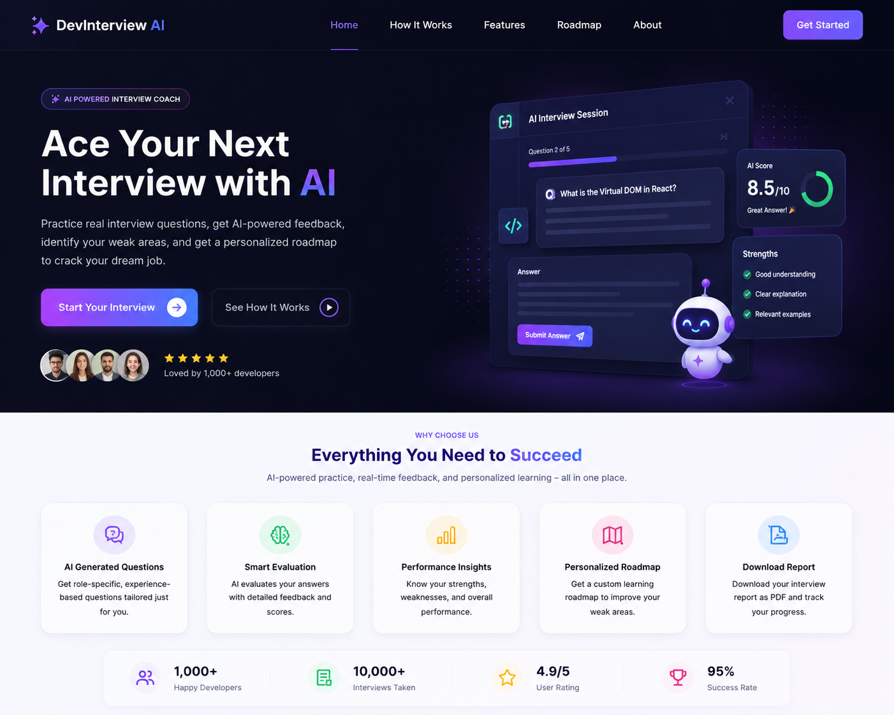

# REACT INTERVIEW COACH

## Core Features

1. Select Role :

   - React Developer
   - MERN Developer
   - Frontend Developer
   - Node.js Developer
   - Full Stack Developer(NEXT-JS)

1. Select Experience Level

   - Fresher (0-1 Years)
   - Junior (1-3 Years)
   - Mid-Level (3-5 Years)

1. Difficulty Level

   - Beginner

   - Intermediate

   - Advanced

1. Generate 5 AI Interview Questions(If Time Permits It will be 10 AI Interview Questions)

1. User submits answers.

1. AI evaluates answers.

1. Final Score Generation.

1. Interview Readiness Meter

- 90-100 → Interview Ready

- 75-89 → Almost Ready

- 60-74 → Needs Improvement

- Below 60 → Focus on Fundamentals

Bonus Features :

- Personalized Learning Roadmap.

Example :

Weak Areas:

- Closures
- Event Loop
- useMemo

Week 1:

- Closures
- Scope
- Hoisting

Week 2:

- React Rendering
- useMemo
- useCallback

Week 3:

- Zustand
- Redux Toolkit

## Tech Stack -

- React + Vite

- Tailwind CSS

- Zustand

- React Hook Form

- Zod

- Gemini API

- jsPDF

- Vercel

## Development Order

- Phase 1 → Project Setup
- Phase 2 → Interview Setup Screen
- Phase 3 → Zustand Store
- Phase 4 → Gemini Integration
- Phase 5 → Question Screen
- Phase 6 → Evaluation Screen
- Phase 7 → Results Page
- Phase 8 → Learning Roadmap
- Phase 9 → PDF Generation
- Phase 10 → Deployment

---

## Application's pages and user Flow

```text
Home Page
   ↓
Setup Interview Page
   ↓
Question Page
   ↓
Evaluation Page
   ↓
Results Page
   ↓
Roadmap + PDF Download
```


